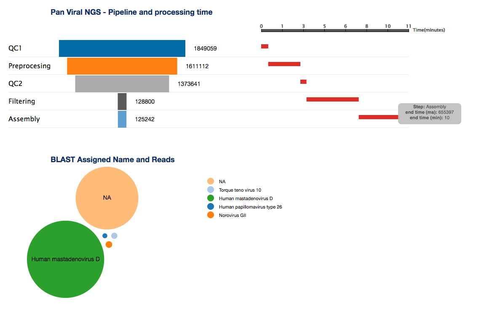

#### Pan Viral Tool NGS Pipeline Redesign

The redesign of the assignment chart which is currently a bar chart and the inclusion of pipeline visualizations

##### Data

Currently the xml input is from the data directory within the project folder however in future it needs to be changed with the right source
<p> Since the data is in xml some parsing is necessary to provide some JSON structure and make it ready to be visualized using the d3 library

##### Code Flow

#####  xml Parsing

The first block of the script parses the xml file and creates array and objects.

###### Example
```javascript
d3.xml("./data/ngs-results.xml", function (error, data) {

    var pipeLine = [];
    var qc1_endTime = +data.querySelector("qc1 > end-time-ms").textContent,
        qc1_read_Length = +data.querySelector("qc1 > read-length").textContent,
        qc1_read_count = +data.querySelector("qc1 > read-count").textContent

        pipeLine.push({
                    step: "QC1",
                    reads: qc1_read_count,
                    endTime: qc1_endTime
                    })
    });
```

##### Render/Draw

The parsed data is then passed to a function that draws pipeline and taxonomy related visualizations using svg elements

</img>